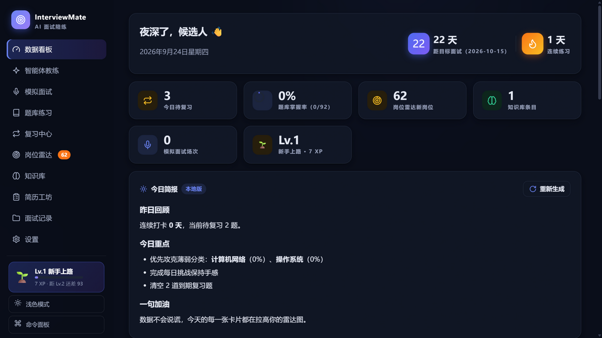
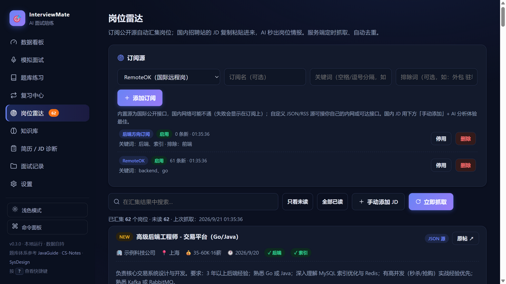
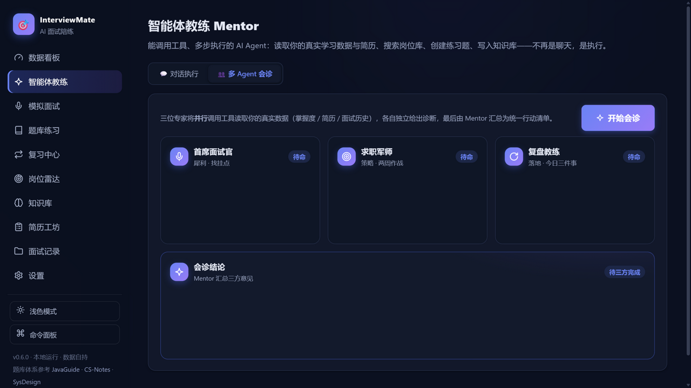
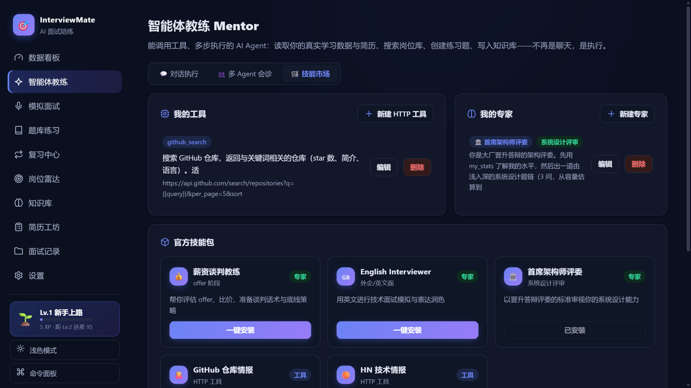
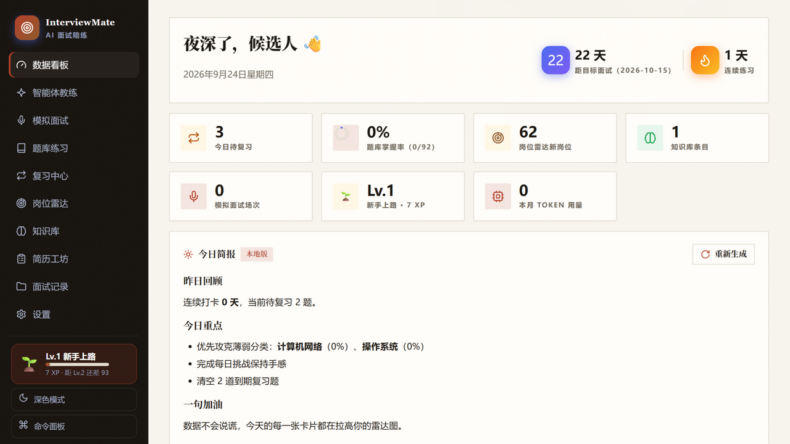
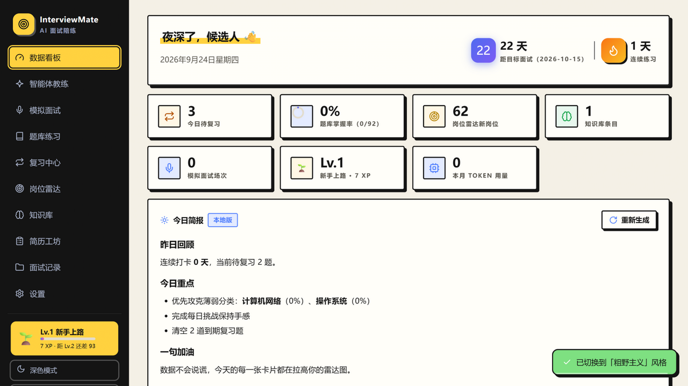

# 🎯 InterviewMate · AI 面试陪练

   

> 你的私人 AI 面试官 —— **智能体教练**、模拟面试、间隔重复复习、岗位雷达、简历工坊、个人知识库，本地运行、数据自持。

**InterviewMate** 参考了 GitHub 上最知名的一批面试开源项目（CS-Notes、JavaGuide、tech-interview-handbook、system-design-primer 等）的知识体系与题型结构，但走了一条不同的路：**把静态知识库变成 AI Agent 驱动的面试训练系统**。智能体教练能调用工具读取你的真实数据、多步执行任务；AI 面试官逐题追问并评分；间隔重复算法安排复习；岗位雷达自动汇集机会；简历工坊结构化诊断。

| 数据看板 | 岗位雷达 |
| --- | --- |
|  |  |
| **多 Agent 会诊** | **技能市场** |
|  |  |

**🎨 三套设计风格一键切换**（v0.14，设置 → 设计风格）：✨ **极光**（玻璃质感渐变）/ 📰 **编辑部**（衬线大标题·纸张底色·朱砂点睛，像一本高级求职杂志）/ 🧱 **粗野主义**（墨线描边·硬投影·荧光黄高亮，大胆外放）

| 编辑部风格 | 粗野主义风格 |
| --- | --- |
|  |  |

## ✨ 功能特性

### 🤖 主打特色：智能体教练（v0.5）

**Mentor** 是一个真正能「干活」的 AI Agent——不靠特定厂商的 function calling，用提示词工具协议实现，**任何 OpenAI 兼容模型都能跑**：

| 内置工具 | 能力 |
| --- | --- |
| `my_stats()` | 读取各分类掌握度、待复习数、错题数、模拟面试得分历史、目标面试倒计时 |
| `search_bank(query)` | 检索题库（含掌握状态） |
| `get_resume()` | 读取简历工坊中的当前简历 |
| `search_jobs(query)` | 检索岗位雷达已汇集的岗位 |
| `add_cards(cards)` | **直接创建练习题**并入题库与复习系统 |
| `save_knowledge(...)` | **直接写入知识库** |
| `search_knowledge(query)` | 检索用户知识库（标题/内容/标签） |
| `my_wrong()` | 读取错题本（挂科次数最多的题目） |

多步执行循环：模型输出 `TOOL: {...}` → 本地执行 → 结果回灌 → 继续推理（最多 4 轮），界面上以工具芯片实时展示每次调用。内置任务卡：**距面试冲刺计划**（结合倒计时与错题本）、**弱项体检 + 7 天冲刺计划**（自动建题）、**简历 × 岗位匹配**（自动存档）、**今日特训清单**。

**🎯 冲刺与复盘套件**（v0.10）：

- **面试倒计时**：设置目标面试日期，看板常驻 D-Day 倒计时，Agent 与每日简报自动围绕剩余天数排计划
- **错题本**：评「不会」的题自动聚合，按挂科次数排序，一键「错题重练」
- **分享成绩单**：面试报告一键生成 1200×675 精美成绩卡（评分环 + 维度条 + 渐变光斑），下载即发朋友圈
- **新手引导**：首次访问三步上手（v0.9）

**💰 Token 用量面板**（v0.13）：每个 AI 请求自动记账——优先读取接口返回的真实 `usage`（精确），缺失时按中英文加权本地估算并标注；累计/今日/本月/费用粗估（内置常见模型价目表）、14 天输入输出双柱趋势、场景分布、逐笔明细（最多 600 条），支持导出与清空。看板瓦片、设置页、命令面板（搜「用量」）三处可达；服务端定时简报的用量单独统计展示。

**🛒 Agent 技能市场**（v0.8）：把 Agent 从固定功能变成可扩展平台——

- **自定义 HTTP 工具**：在界面定义工具（名称/用途/URL 模板），模型即可调用；执行由本机服务代理（绕开 CORS，12s 超时），可接入内网接口或任何公开 API
- **自定义专家**：一段人设 + 任务指令就是一个新专家，加入多 Agent 会诊团（最多 5 位，⭐标记）
- **官方技能包**：薪资谈判教练、English Interviewer、首席架构师评委（专家）；GitHub 仓库情报、HN 技术情报（工具）——一键安装
- **技能分享**：全部技能导出为 JSON，朋友一键导入

**👥 多 Agent 会诊**（v0.6）：自选专家团（内置三位 + 你的自定义专家）**并行**调用工具读取你的真实数据，各自独立产出诊断，最后由 Mentor 汇总三方意见去重合并，输出「本周行动清单 Top5」。

**☀️ 每日简报**（v0.6）：三级生成通道——① 服务端配置 `.env` Key 后，调度器定时基于数据快照自动生成当日简报；② 无服务端 Key 时打开看板用页面 Key 现场生成；③ 完全离线时本地兜底版（薄弱分类+待复习+打卡）。看板首屏展示，每日自动刷新。

**🎮 游戏化进度系统**（v0.7，参考 Duolingo）：XP 计分（答题/面试/诊断/学习卡全动作）、七级成长线（🌱新手上路 → 👑传说面神）、13 枚成就徽章墙（高分时刻、连续打卡、全图鉴…），升级与成就解锁即时礼花。

**对标 Anki 生态补齐的记忆功能**（v0.7）：

- **填空卡（Cloze）**：自动遮住答案中的关键术语（优先加粗段与技术词），主动回忆再翻面——Anki 最被验证的卡片形态
- **限时口述（60s）**：题目 + 倒计时条，时间到自动翻面，练「开口说」的临场感
- **练习年历**：GitHub 贡献图风格的 26 周热力墙
- **未来 7 天复习量预测**：到期题分布柱状图，提前安排时间
- **Anki 牌组互通**：题库一键导出为 Anki TSV 牌组（分类自动变标签）；反向把 Anki 导出的笔记变成你的练习题

**📱 PWA 可安装**（v0.7）：manifest + Service Worker（网络优先、离线兜底），浏览器里「安装应用」即可变成桌面/手机上的独立 App。

### 🧠 学习闭环

| 模块 | 说明 | 是否需要 API Key |
| --- | --- | --- |
| 🤖 **智能体教练** | 工具调用 + 多步执行的 AI Agent，任务卡一键发起 | ✅ |
| 🎙️ **模拟面试** | 单场/四轮闯关（技术→项目→系统设计→HR，终局裁定）；**语音整场面试**（自动播报+自动聆听+停顿即发送）；AI 面试官逐题追问+评分报告 | ✅ |
| 📊 **数据看板** | 能力雷达图、得分趋势线、14 天练习热力、分类掌握进度、连续打卡、新岗位数、最近动态 | ❌ |
| 🔁 **复习中心** | Leitner 间隔重复：「不会/模糊/掌握」三级自评，自动安排 10 分钟/1/3/7/21 天后复习；到期队列 + 提前学新题 | ❌ |
| 🃏 **闪卡引擎** | 3D 翻转卡片，键盘评分（空格翻面，1/2/3 评分），单题速练 / 组卷刷题 / 错题回炉 | ❌ |
| ⚡ **每日挑战** | 按日期确定性选题，一天一题保持手感，计入连续打卡 | ❌ |
| 📚 **题库练习** | **90+ 内置高频题、11 大分类**（含 Java 专项、手写代码模板），相关题目推荐、多维筛选、收藏、**题目笔记**、掌握标记、AI 追问、题库导出 | 部分（AI 追问需要） |
| 📡 **岗位雷达** | 订阅公开源（RemoteOK / HN 招聘帖 / 自定义 JSON / RSS）**定时自动抓取**，关键词过滤 + 去重 + 未读徽标；**选择简历后本地匹配分自动排序**；AI 岗位情报 | 抓取/匹配❌ / AI 分析✅ |
| 🧠 **知识库** | Markdown 知识条目 + 标签 + 全文检索；**AI 剪藏生成学习卡**：贴一篇文章 → 摘要 + 3-8 张问答卡 → 一键进题库与间隔重复 | 新建❌ / AI 生成✅ |
| 📋 **简历工坊** | **多版本简历管理**；结构化诊断报告：动画评分环 + 能力雷达 + JD 要求覆盖清单 + 风险点改写示例；**追问预测一键转为练习题**；**AI 润色**（前后对照） | ✅ |
| 🗂️ **面试记录** | 分类筛选、回看、**导出 Markdown**、**打印/保存 PDF** | ❌ |

### 🎨 界面与体验

- **极光渐变背景**：双光斑缓慢漂移，浅深色主题各有着色
- **玻璃拟态**：深色模式卡片与侧栏毛玻璃质感（backdrop-filter）
- **微交互包 v0.11**：卡片**聚光灯**（光斑跟随指针）、全屏噪点质感、按钮涟漪、**顶部流式进度条**（AI 请求自动触发）、Toast 消退进度线、AI 消息悬停复制、命令面板命中高亮、导航图标微动画、tabular-nums 等宽数字
- **动效体系**：数字滚动、评分环动画、视图转场、列表交错入场、卡片悬浮微交互、高分礼花特效
- **深色 / 浅色主题**：跟随系统 + 手动切换，图表随之重绘；尊重 `prefers-reduced-motion`；`:focus-visible` 键盘焦点环
- **命令面板**：<kbd>Ctrl+K</kbd> 呼出，模糊搜索所有页面与动作，命中片段高亮
- **全局搜索**：题库 + 知识库 + 笔记一站检索，点击直达
- **键盘流**：<kbd>1-9</kbd> 切页、<kbd>/</kbd> 搜题、<kbd>?</kbd> 查看全部快捷键
- **语音**：面试官提问可朗读（TTS）；回答可语音输入（Chrome/Edge 语音识别）
- **零依赖自绘 UI**：内联 SVG 图标库、Canvas 雷达/折线/环形图、翻转闪卡、骨架屏、Toast、Modal、分段控件——不依赖任何前端框架与 CDN，完全离线可用
- **数据自持**：全量数据一键备份/恢复 JSON，跨设备迁移

## 🚀 快速开始

要求 **Node.js 18+**（零 npm 依赖，无需 `npm install`）：

```bash
node server.js
# 或
npm start
```

打开 <http://127.0.0.1:3000> 即可使用。

### 配置模型

除 AI 对话类功能（模拟面试 / AI 追问 / 简历诊断 / 岗位情报 / 学习卡生成）外，**其余全部功能开箱即用、离线可用**。AI 功能支持**任何 OpenAI 兼容接口**，推荐 [智谱 GLM](https://open.bigmodel.cn/)（注册即有免费额度）：

1. 打开页面「设置」；
2. 选择服务商预设（智谱 GLM / OpenAI / DeepSeek / Kimi / 本地 Ollama / 自定义）；
3. 填入 API Key，点「测试连接」验证；可微调 temperature。

密钥只保存在**你自己的浏览器 localStorage** 中，请求经本机服务转发，不经过任何第三方。也可以在服务端配置（复制 `.env.example` 为 `.env`），页面配置优先于服务端配置：

```ini
INTERVIEW_MATE_API_KEY=你的key
INTERVIEW_MATE_BASE_URL=https://open.bigmodel.cn/api/paas/v4
INTERVIEW_MATE_MODEL=glm-4-flash
PORT=3000
# 岗位雷达自动抓取间隔（分钟），0 = 关闭
INTERVIEW_MATE_JOB_REFRESH_MIN=30
```

### 岗位雷达怎么用

**关于国内招聘站（Boss 直聘、拉勾等）**：它们需要登录且有强反爬，本项目不做、也不建议做这类爬虫。岗位雷达提供三条正路：

1. **内置国际公开源**：RemoteOK（国际远程岗）、Hacker News 每月「Who is hiring」帖——添加订阅、填关键词即可，服务端每 30 分钟自动抓取（国内网络对这两个源的可达性视运营商而定，失败会显示在订阅条目上）；
2. **自定义源**：任何返回 JSON 数组（`[{title, url, company, location, salary, date, description}]`）或标准 RSS 的地址都能接入——比如你公司内推接口、朋友搭的聚合服务；
3. **手动粘贴 + AI 情报**（国内 JD 推荐）：把招聘页的 JD 整段复制进「手动添加」，点「AI 岗位情报」自动提取硬性要求、加分项、面试重点预测，可存入知识库，或一键带去「简历/JD 诊断」做深度匹配。

### 自定义题库

设置 → 自定义题库 → 导入题目，粘贴 JSON 数组即可：

```json
[
  { "q": "你的题目", "a": "参考答案（支持 - 列表与 **加粗**）", "diff": 2, "tags": ["面经", "字节"] }
]
```

导入后并入题库「自定义」分类，进入闪卡、组卷、复习计划全部流程。支持导出分享。更省事的方式：知识库 → 「AI 生成学习卡」→ 粘贴材料 → 一键导入。

## 🧱 架构

刻意保持简单：**零依赖 Node.js 服务 + 原生 ES Modules 前端**，clone 即用，想换技术栈随时可换。

```
┌────────────────────────── 浏览器 ──────────────────────────────┐
│  index.html / css/style.css                                    │
│  js/  app.js(入口/命令面板/全局搜索)  router.js(路由表)           │
│       core.js(存储/图标/Toast/Modal/主题/Canvas图表/Markdown)     │
│       state.js(全局状态)  api.js(流式对话)  srs.js(间隔重复算法)   │
│       views/ dashboard·mock·bank·review·jobs·knowledge·        │
│               resume·history·settings·flashcards               │
│  个人数据持久化在 localStorage（可备份导出）                       │
└───────────────┬────────────────────────────────────────────────┘
                │ fetch /api/questions · /api/chat · /api/jobs*
┌───────────────▼─────────────── server.js（Node 18+，零依赖）─────┐
│  lib/jobs.js 岗位雷达引擎：源适配器(RemoteOK/HN/RSS/JSON)·         │
│               关键词过滤·去重·定时调度·文件存储                    │
│  · 静态资源托管（no-store）                                       │
│  · GET  /api/questions  → data/questions.json（内置题库）         │
│  · POST /api/chat       → 组装系统提示词 → 流式透传到 LLM          │
│  · /api/jobs*           → 订阅/抓取/岗位列表（data/jobs-store.json）│
└──────────────────────────────┬───────────────────────────────────┘
                               ▼
              任意 OpenAI 兼容 LLM + 公开岗位源
```

### 复习算法

简化版 Leitner 盒子：每题一张卡 `{box 0..4, due, reps, lapses}`。评「不会」回到 box0（10 分钟后重现），「模糊」保持 box1（明天），「掌握」升一级；box3+ 视为已掌握（间隔 7 天 → 21 天）。练习动作（答题、评分、诊断）都会写入活跃度，用于连续打卡与热力图。

## 📚 与知名开源项目的关系

面试准备领域的经典项目几乎都是**静态知识库**，它们构成了 InterviewMate 题库与提示词设计的地基：

| 项目 | 我们借鉴的东西 |
| --- | --- |
| [CS-Notes](https://github.com/CyC2018/CS-Notes) | 知识分类体系（网络/OS/数据库/算法…）与「要点式」答案风格 |
| [JavaGuide](https://github.com/Snailclimb/JavaGuide) | 高频题选取、由浅入深的追问路径 |
| [advanced-java](https://github.com/doocs/advanced-java) | 高并发/分布式类目的深度问题 |
| [tech-interview-handbook](https://github.com/yangshun/tech-interview-handbook) | 行为面试方法论（STAR、反问策略）与算法分级 |
| [system-design-primer](https://github.com/donnemartin/system-design-primer) | 系统设计题的「需求→估算→设计→扩展」答题框架 |
| [javascript-algorithms](https://github.com/trekhleb/javascript-algorithms) | 前端/算法题的数据结构覆盖面 |
| [Backoffer](https://github.com/afatcoder/Backoffer) | 真实面经中的高频追问点 |
| Anki（间隔重复思想） | Leitner 盒子复习调度 |

**我们的差异定位**：这些项目回答「面试考什么」，InterviewMate 回答「你现在答得怎么样、什么时候再复习、外面有什么机会」——交互式模拟、即时点评、量化报告、记忆曲线调度、岗位情报。两者配合食用效果最佳。

## 🗺️ Roadmap

- [x] 深色模式与命令面板（v0.2）
- [x] 间隔重复复习 + 闪卡 + 每日挑战（v0.2）
- [x] 语音朗读 / 语音输入（v0.2）
- [x] 自定义题库导入 + 全量备份（v0.2）
- [x] 岗位雷达：多源订阅 + 定时抓取 + AI 岗位情报（v0.3）
- [x] 个人知识库 + AI 剪藏生成学习卡 + 全局搜索（v0.3）
- [x] 题库扩容至 90 题（Java 专项 / 手写代码）+ 相关题推荐（v0.4）
- [x] 简历工坊：多版本管理 + 结构化诊断 + 追问转题 + AI 润色（v0.4）
- [x] 视觉 2.0：极光背景 / 玻璃拟态 / 动效体系 / 礼花（v0.4）
- [x] **智能体教练：工具调用 + 多步执行的 AI Agent**（v0.5 主打）
- [x] 语音整场面试（自动播报+聆听+发送）（v0.5）
- [x] 四轮面试闯关（技术→项目→系统设计→HR，终局裁定）（v0.5）
- [x] 岗位本地匹配分自动排序（v0.5）
- [x] **多 Agent 会诊**（三专家并行 + 汇总裁决）（v0.6）
- [x] **每日简报**（服务端定时 / 客户端 AI / 本地兜底三级通道）（v0.6）
- [x] **游戏化系统**（XP / 等级 / 成就墙，对标 Duolingo）（v0.7）
- [x] **Anki 式记忆套件**（填空卡 / 限时口述 / 练习年历 / 复习预测 / Anki 互通）（v0.7）
- [x] **PWA 可安装**（网络优先 SW，离线兜底）（v0.7）
- [x] **Agent 技能市场**（自定义 HTTP 工具 / 自定义专家 / 官方技能包 / JSON 分享）（v0.8）
- [x] 新手引导 + 开源工程化（CI / 贡献指南 / 截图），上线 GitHub（v0.9）
- [x] 冲刺与复盘套件（面试倒计时 / 错题本 / 分享成绩单 / Agent 新工具）（v0.10）
- [x] **UI 微交互包**（聚光灯 / 噪点 / 涟漪 / 流式进度条 / 复制 / 高亮）（v0.11）
- [x] 高级感改造：图标统一 / 排版层级 / 质感升级（v0.12）
- [x] **Token 用量面板**（真实 usage + 本地估算兜底，趋势/分布/费用）（v0.13）
- [ ] 团队部署模式（服务端统一密钥、多用户数据隔离）——按需启动

## ❓ FAQ

**Q：数据安全吗？**
本地工具。所有进度、笔记、记录、密钥都存在你自己的浏览器里（可导出备份）；岗位雷达的订阅与抓取结果存在本机 `data/jobs-store.json`。唯一的网络请求是你自己配置的 LLM 服务与你订阅的岗位源。

**Q：不用 API Key 能干什么？**
看板、题库、复习、闪卡、每日挑战、组卷、知识库笔记、岗位雷达抓取、记录管理全部离线可用。模拟面试、AI 追问、简历诊断、AI 岗位情报、学习卡生成需要模型。

**Q：想换成 React / 加数据库？**
server.js 职责单一（静态 + API 网关），前端是纯静态 ES Modules，lib/jobs.js 独立可测，随时可以平滑迁移。

## 📄 License

[MIT](LICENSE)

## 🤝 贡献

欢迎题目、技能包、UI 与功能贡献——见 [CONTRIBUTING.md](CONTRIBUTING.md)。CI 会自动跑题库完整性与模块自检。
